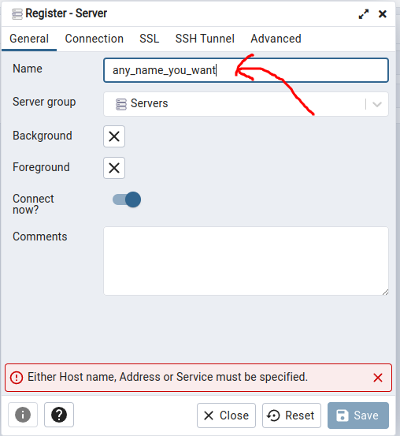
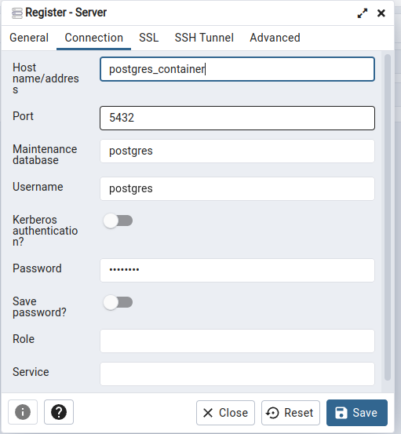

# Postgres Setup

## Setting some env variables

```
    export POSTGRES_PASSWORD=postgres
    export PGADMIN_PORT=5057
```

To install postgres and pgadmin in docker, run `docker-compose up -d`


## Pgadmin connection

To connect to postgres from browser visit `http://localhost:5057/browser/`.      
Then, do as in the pictures:    



Since, `pgadmin` and `postgres` are in the same network in docker, `postgres`  
will be accessible via its `container_name` and container port 

 


